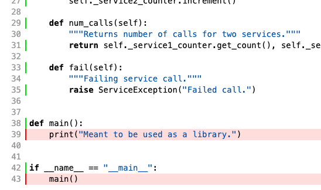

# DemoRepo

[](https://codecov.io/gh/JBEI/DemoRepo)

Maintaining Code health is fundamental if you want someone else to understand and use your code. In this repository we intend to demonstrate best practices with respect to code health and shareability. We will mainly focus on two practices that will make your code more likely to be used by other people: tests and pre-commit hooks. [Tests](https://www.atlassian.com/continuous-delivery/software-testing/types-of-software-testing) are meant to ensure that, if someone modifies the code, they can check they did not break any of its main functionality. Pre-commit hooks are preprocessing scripts that ensure that your file conforms to a more readable code format ([Black](https://github.com/psf/black) in an [example of this](https://black.vercel.app/?version=stable&state=_Td6WFoAAATm1rRGAgAhARYAAAB0L-Wj4ARUAmtdAD2IimZxl1N_WlkPinBFoXIfdFTaTVkGVeHShArYj9yPlDvwBA7LhGo8BvRQqDilPtgsfdKl-ha7EFp0Ma6lY_06IceKiVsJ3BpoICJM9wU1VJLD7l3qd5xTmo78LqThf9uibGWcWCD16LBOn0JK8rhhx_Gf2ClySDJtvm7zQJ1Z-Ipmv9D7I_zhjztfi2UTVsJp7917XToHBm2EoNZqyE8homtGskFIiif5EZthHQvvOj8S2gJx8_t_UpWp1ScpIsD_Xq83LX-B956I_EBIeNoGwZZPFC5zAIoMeiaC1jU-sdOHVucLJM_x-jkzMvK8Utdfvp9MMvKyTfb_BZoe0-FAc2ZVlXEpwYgJVAGdCXv3lQT4bpTXyBwDrDVrUeJDivSSwOvT8tlnuMrXoD1Sk2NZB5SHyNmZsfyAEqLALbUnhkX8hbt5U2yNQRDf1LQhuUIOii6k6H9wnDNRnBiQHUfzKfW1CLiThnuVFjlCxQhJ60u67n3EK38XxHkQdOocJXpBNO51E4-f9z2hj0EDTu_ScuqOiC9cI8qJ4grSZIOnnQLv9WPvmCzx5zib3JacesIxMVvZNQiljq_gL7udm1yeXQjENOrBWbfBEkv1P4izWeAysoJgZUhtZFwKFdoCGt2TXe3xQ-wVZFS5KoMPhGFDZGPKzpK15caQOnWobOHLKaL8eFA-qI44qZrMQ7sSLn04bYeenNR2Vxz7hvK0lJhkgKrpVfUnZrtF-e-ubeeUCThWus4jZbKlFBe2Kroz90Elij_UZBMFCcFo0CfIx5mGlrINrTRFyNsHRkoRBLruYzynsdQIZlZ2M2AAAE3z3tcACOrHAAGHBdUIAADeZ5kXscRn-wIAAAAABFla)). Most
of the configurations were copied from the [EDD repository](https://github.com/JBEI/EDD). 

The repo has two simple python modules, *counter.py* and *service.py*, which are meant only
to illustrate use of the styling and testing approaches and tools.

We would like to keep the styling configs up-to-date so that as many people as possible are
all using the same styles to improve readability of code across projects. Feel free to 
contribute suggestions for modifying these configs.

This repo is designated as a **template** so that **you can create a new repo based on this one**. See the *Using
DemoRepo as a Template* section below to get more info on this process.

## Tests

Unit tests for a module are placed in the same directory with the same name plus a _\_test_ suffix. This
makes unit tests easy to find and run for any given module and also makes obvious which modules do not
have unit tests.

Integration tests, those which involve use of multiple modules, are placed in their own directory.

We do not provide example end-to-end tests for this repo, but they would also have their own directory
and would run in the context of a non-production service (_eg_ a _staging_ or _dev_ service).

### Install poetry

Poetry is emerging as the de-facto standard tool for managing Python dependencies.  There are many
options for using `poetry`, but examples here assume you'll use it to create and manage a virtual
environment (aka virtualenv) specific to your project.  Virtual environments help prevent 
conflicting Python dependencies interfering with one another, e.g. if you work on multiple projects 
on the same computer.

1.  [Install poetry][https://python-poetry.org/docs/]
2. Install the [poetry-dynamic-versioning][https://github.
   com/mtkennerly/poetry-dynamic-versioning] plugin
3. Create a virtualenv for this project (run from the repo base directory)
    `poetry install --with dev`
4. Open a shell in the virtualenv
    This enables you to use Python dependencies installed by poetry.
    ```
   poetry shell # CRTL-D to exit when finished
    ```

### Test Coverage

Activate the poetry virtualenv to use the installed Python packages.

```poetry shell```

The coverage tool is called in the _run_all_tests.sh_ script. It will show you a text description 
of the coverage if the tests all pass, and it will generate a directory of html that gives a more
detailed description of the coverage. You can access this by running:

```open htmlcov/index.html```

This can be very useful for inspecting uncovered parts of the code. For example, in this repo we 
adopt a style that all python should have an executable main(), even if it is intended to be used
as a library module. We do _not_ test this code, which you can see when you inspect the coverage details:



### Testing Notebooks

DemoRepo contains two jupyter notebooks in */notebooks*. This directory also contains a script
to run the notebooks with *runipy*. To run this script, first activate the poetry virtualenv:

```poetry shell```

You can then run the script:

```
cd notebooks
./run_notebook_tests.sh
```

Note that these tests only ensure that the notebooks can execute; they do not test correctness of
the notebook code.

For demonstration purposes, the directory contains one notebook that succeeds, *WorkingDemoRepoNotebook.ipynb*,
and one that fails, *FailingDemoRepoNotebook.ipynb*.

## Pre-commit

This repo includes a _.pre-commit-config.yaml_ file which sets up the hooks to run tools before a
commit can complete. These tools help standardize formatting and clean up code
(e.g. remove unused imports) before it is submitted. 

To install pre-commit in your env, run:

```pip install pre-commit```

You can then install the pre-commit script in your local repo by running:

```pre-commit install```

If you have a _.pre-commit-config.yaml_ file in your repo, you will notice differences in your next commit.
The tools specified in _.pre-commit-config.yaml_ will run and will block the commit if any
errors are found. It may be helpful to run the tools directly when you are trying to fix these errors.
Pre-commit runs the same checks as the GitHub continuous integration, so running it at commit 
time helps you to catch errors earlier in the process.

### Running Black and Flake8

For the Python tools _black_ and _flake8_, pre-commit will install and run the tools for you.

If you have errors in say _myfile.py_, you can fix the formatting errors with:

```pre-commit run black --file myfile.py```

Don't forget to add the changes to the staged area before you retry your commit.

For _flake8_ errors, you can list them by running _flake8_ directly, but you
may have to make fixes by hand.

```pre-commit run flake8 --file myfile.py```

### Advanced use

See [Advanced.md](Advanced.md) for examples that may be helpful for advanced use.

## Automated Documentation

A [separate document](https://docs.google.com/document/d/1xT5Ay4Ua7F5cX_-tG9iEuOd7B0yTREuAh47GkKAlZt8/edit) is available describing how to set up Sphinx for auto-generation of documents for this project. The steps should be comparable for any project using this project as a template.

## Using DemoRepo as a Template

Follow the steps below to create a new repo using DemoRepo as a template:

1. Go to the [DemoRepo GitHub page](https://github.com/JBEI/DemoRepo) and click the *Use this template* button. Pick a name for your new template and create it.
2. Clone the new repo for editing.
3. Remove the notebooks in */notebooks/*.
4. Remove the images in */images/*.
5. Remove the python files in */demo_repo/* and */demo_repo/integration_tests/*.
6. Rename the */demo_repo/* source directory to the name of your repo. Update the directory name in *run_all_tests.sh*.
7. Modify *pyproject.toml* as needed for your repo.
8. Run `poetry lock` to lock Python dependencies based on *pyproject.toml*
9. Go to [CodeCov repository page](https://codecov.io/gh/JBEI) and add your new repo.
10. Go to the *Settings* your repo in CodeCov and copy the *Repository Upload Token*. Edit the 
   *codecov.yml* file in your local repo and replace the token with the one you copied.
11. Update the markdown README file for your repo. Note that you will want to get a new code 
    coverage badge which is available in *Settings* under the *Badge* section (left-hand panel). For example, the link to the badge for the DemoRepo project is available [here](https://app.codecov.io/gh/JBEI/DemoRepo/settings/badge).
12. Double check set up instructions in the DemoRepo README to ensure that pre-commit is ready 
    to go.
